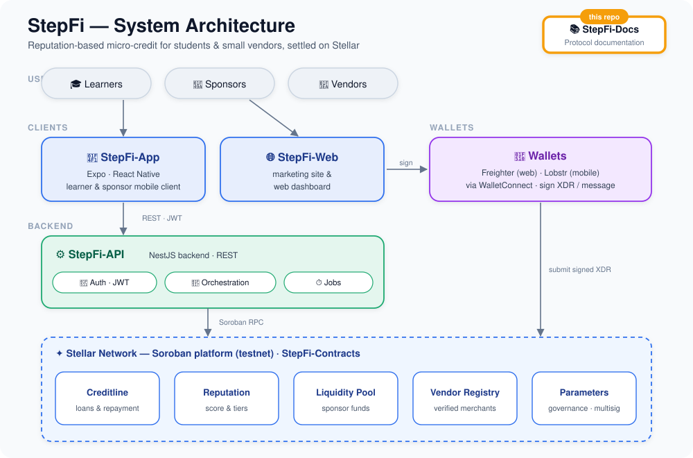

# StepFi-Docs

**The protocol documentation for StepFi — reputation-based, collateral-light credit on Stellar.**

Guides, contract references, API references, and contributor docs for the whole StepFi protocol, published with [docs.page](https://docs.page).

**📖 Read the docs:** https://docs.page/StepFi-app/StepFi-Docs

---

## 📖 What is this?

StepFi lets learners and interns borrow small amounts against an **on-chain reputation score** instead of collateral, repay in installments, and build credit — while sponsors fund a shared liquidity pool, vendors get paid directly, and mentors vouch to boost reputation. This repository is the **documentation** for that protocol: how it works, every smart contract, every API surface, the mobile client, and how to contribute.

## 🗺️ Where it fits

StepFi-Docs is the reference layer that documents every other repository in the protocol — the contracts, the API, and the clients.

## 🧭 What's inside

Content lives in [`docs/`](docs) as MDX, with the site structure and navigation defined in [`docs.json`](docs.json):

| Section | Covers |
|---------|--------|
| **Overview · Architecture · Quick Start** | Protocol intro, system architecture, getting started |
| **Protocol** | How it works, learner flow, sponsor flow, mentor vouching, the reputation system |
| **Smart Contracts** | Creditline, Reputation, Liquidity Pool, Vendor Registry, Parameters |
| **API** | Authentication, loans, liquidity, sponsors, vendors, reputation, vouching, the playground |
| **Mobile** | App overview, screens, wallet connection |
| **Contributing** | Contribution overview and per-area guides (backend, contracts, mobile, code standards) |

## ✍️ Editing the docs

The site is rendered directly from this repository by **docs.page** — there is no build step or generated output to commit.

1. Edit or add an `.mdx` file under [`docs/`](docs).
2. If you add, remove, or move a page, update its entry in [`docs.json`](docs.json) so it appears in the sidebar.
3. Open a PR. docs.page serves a preview for your branch/PR, and the changes go live at the URL above once merged to `main`.

> Note: this project uses docs.page's `docs.json` format — it is **not** a Mintlify site, so don't reach for the Mintlify CLI.

## 🔄 CI

Every push and PR runs [`.github/workflows/ci.yml`](.github/workflows/ci.yml), which executes [`.github/scripts/validate-docs.mjs`](.github/scripts/validate-docs.mjs) to validate `docs.json` and check that every sidebar link resolves to a real page. Keep it green — broken links fail the build.

## 🌐 The StepFi protocol

| Repo | Role |
|------|------|
| **StepFi-Docs** (this repo) | Protocol documentation |
| [StepFi-Contracts](https://github.com/StepFi-app/StepFi-Contracts) | Soroban smart contracts (credit, reputation, liquidity) |
| [StepFi-API](https://github.com/StepFi-app/StepFi-API) | Backend — auth/JWT, orchestration, jobs |
| [StepFi-App](https://github.com/StepFi-app/StepFi-App) | Learner mobile client (Expo / React Native) |
| [StepFi-Web](https://github.com/StepFi-app/StepFi-Web) | Sponsor / vendor / mentor web app |
